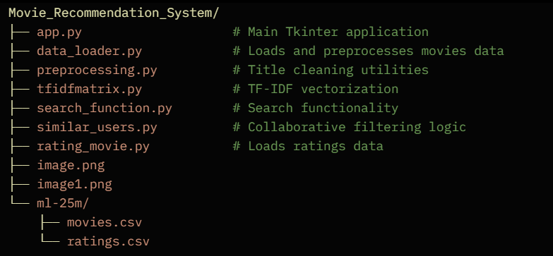
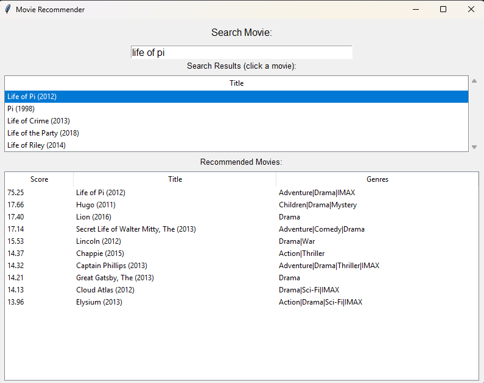

# 🎬 Movie Recommendation System

A powerful movie recommendation desktop application built with Python and Tkinter. It combines **content-based search** (TF-IDF on movie titles) with **collaborative filtering** (similar users based on high ratings) to suggest relevant movies from the MovieLens 25M dataset.

  
*Main application window with search and recommendations*

## ✨ Features

- **Real-time Search**: Type a movie title to find matches using TF-IDF vectorization on cleaned titles.
- **Smart Recommendations**: Get top recommendations based on users who rated the selected movie highly (>4 stars).
- **Clean UI**: Built with Tkinter Treeviews for easy browsing of search results and recommendations.
- **Genre Information**: Displays movie genres alongside recommendations.
- **Fast & Responsive**: Efficient similarity search and scoring.

  
*Example of search results and personalized recommendations*

## 🛠️ Technologies Used

- **Python**
- **pandas**
- **scikit-learn** (TF-IDF & cosine similarity)
- **Tkinter** (GUI)
- **MovieLens 25M Dataset**

## 📥 Download the Dataset

👉 **[Download ml-25m.zip](https://files.grouplens.org/datasets/movielens/ml-25m.zip)**

**After downloading:**
1. Extract the zip file
2. Create a folder named `ml-25m` in the project root
3. Place `movies.csv` and `ratings.csv` inside the `ml-25m` folder

## 🚀 How to Run

1. **Clone the repository**
   ```bash
   git clone https://github.com/PrajwolKhadka/Movie_Recommendation_System.git
   cd Movie_Recommendation_System

Install DependenciesBashpip install pandas scikit-learn
Run the ApplicationBashpython app.py

📁 Project Structure
BashMovie_Recommendation_System/
├── app.py                    # Main Tkinter application
├── data_loader.py            # Loads and preprocesses movies data
├── preprocessing.py          # Title cleaning utilities
├── tfidfmatrix.py            # TF-IDF vectorization
├── search_function.py        # Search functionality
├── similar_users.py          # Collaborative filtering logic
├── rating_movie.py           # Loads ratings data
├── image.png
├── image1.png
└── ml-25m/
    ├── movies.csv
    └── ratings.csv
📖 How It Works

Search: As you type, the app finds movies with similar titles using TF-IDF on cleaned titles.
Select a Movie: Click on a search result.
Get Recommendations: The system finds users who loved that movie (rating > 4) and recommends other movies they also loved.

🔧 Future Improvements

Add movie posters using TMDB API
Hybrid recommendation system
Dark mode UI
Export recommendations
Web version (Streamlit/Flask)

📄 License
This project is open-source and available under the MIT License.